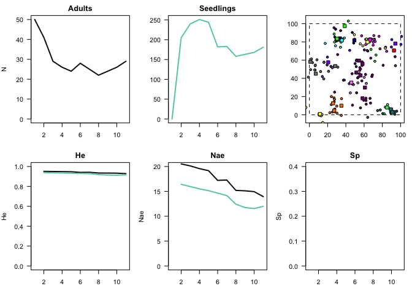

### dispersim

*dispersim* is an R package for simulating pollen and seed dispersal in plant populations. It simulates individual-level effects (seed and pollen movement, survival) to generate population-level patterns. The simulation framework is flexible and designed to be both an exploratory tool and a means to perform large scale simulations parameterized with field data.

===============

To install dispersim on your computer, you must first make sure the package 'devtools' is installed. This will allow you to install dispersim directly from github.

``` r

install.packages("devtools")

devtools::install_github("lukembrowne/dispersim")
```

=================

Here's an example of a typical workflow to run a basic simulation (code is given below)...

-   format parameters for a given simulation into a list (template is below)
-   initialize the simulation with initSim(), which takes the parameter list as an argument
-   run simulation forward in time with runSim()
-   visualize the simulation with plotting functions.. e.g. plotSim(), plotSummary(), plotKernels()

===============

dispersim is very much still in active development, and certainly contains many bugs. If you're interested in contributing, have any comments or suggestions, please get in touch via github or email - <lukembrowne@gmail.com>

=================

``` r
library(dispersim)

params <- list(
            # Landscape parameters
          x_max = 100,
          y_max = 100,
          boundary_setting = "unsuitable",
          
            # Expected number of steps and individuals
          expected_total_individuals = 100000,
          
            # Num of starting adults
          n_adults_init = 50,
          
            # Genetic parameters
          n_loci = 10,
          n_alleles_per_loci = 20,
          loci_names = makeLociNames(n_loci = 10),
          
            # Demographic parameters
          age_at_adult = 5,
          crop_size = 5,
          adult_survival = .8,
          seedling_survival = "random", # Random or distance dependent
          seedling_survival_prob = .5,
          seedling_survival_dist_location = 10,
          seedling_survival_dist_scale = 1,
          
            # Dispersal parameters. based in Weibull PDF
          seed_kernel_scale = 10,
          seed_kernel_shape = 1,
          pollen_kernel_scale = 10,
          pollen_kernel_shape = 1
          )

# Create new simulation
sim <- initSim(params = params)
#> Checking parameter list for errors...
#> No errors detected in parameter list... Everything looks great.
#> Data frame initialized...
#> Counter initialized... 
#> Registry initialized... 
#> Adults initialized... 
#> Loci for Adults initialized...
#> Summary initialized... 
#> Simulation successfully inialized!


# Run simulation forward in time
runSim(sim, steps = 10)
#> Beginning simulation... 10 total steps 
#> 10 % complete 
#> 20 % complete 
#> 30 % complete 
#> 40 % complete 
#> 50 % complete 
#> 60 % complete 
#> 70 % complete 
#> 80 % complete 
#> 90 % complete 
#> 100 % complete
```



    #> --- Simulation complete! ---


    # Plot simulation landscape
    plotSim(sim)


``` r


# Plot dispersal kernels
plotKernels(sim, type = "adult", step = 10)
```


